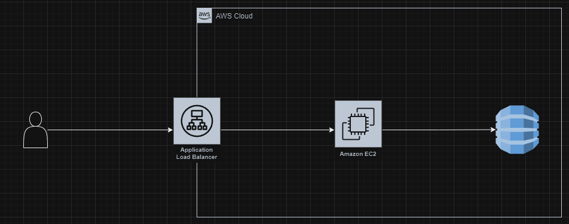

# Fallas en la arquitectura

Más allá de las fallas en el código que se está utilizando y las malas prácticas que se han implementado en la creación de este código, siento que a nivel de arquitectura podemos encontrar una amplia oportunidad de crecimiento. Dado que es un juego, requerirá de una latencia baja si se piensa en un modo multijugador. Además, necesita poder modificarse para atraer a nuevos jugadores a través de nuevos modos de juego, no solo el simple buscaminas de toda la vida, sino también buscar algunos retos que a futuro permitan que sea más atractivo. Por lo tanto, la arquitectura que se quiera plantear debería ser susceptible al cambio.

A nivel de disponibilidad, se podría negociar según cómo el juego crezca o se necesite. No es una urgencia tan grande. Lo mismo ocurre a nivel de seguridad, a menos de que se implementen micro pagos con mejoras, no sería necesario este aspecto.

Teniendo esto en cuenta, podríamos buscar una arquitectura cliente-servidor implementada en la nube, lo cual cumpliría con los parámetros básicos que se expusieron al inicio. Esta arquitectura permitiría una escalabilidad y flexibilidad adecuadas para adaptarse a las necesidades cambiantes del juego. Además, la implementación en la nube proporcionaría la infraestructura necesaria para manejar la latencia baja requerida para el modo multijugador.

Además, es importante considerar la posibilidad de implementar una arquitectura de microservicios. Esto permitiría un desarrollo y despliegue independiente de diferentes aspectos del juego, lo que facilitaría la introducción de nuevos modos de juego y características. También podría ayudar a mejorar la resiliencia y la disponibilidad del juego.

Finalmente, en cuanto a la seguridad, aunque no sea una prioridad en este momento, siempre es importante tener en cuenta las mejores prácticas de seguridad. Esto incluiría la encriptación de los datos sensibles, la implementación de autenticación y autorización robustas, y la realización de auditorías de seguridad regulares. Si en el futuro se decide implementar micro pagos, estos aspectos de seguridad se volverán aún más importantes.

La arquitectura que se plantea es básica, pero ofrece la posibilidad de crecer dependiendo de la carga. Esto es crucial para evitar futuros problemas de arquitectura. En este caso, un usuario consulta al servidor, que será la máquina EC2 con el código del juego, la cual estará enlazada a una base de datos. Dependiendo de las mejoras que se le hagan al sistema, se pueden buscar soluciones más robustas para disuadir problemas de inicio de sesión o nuevas funcionalidades. Por el momento, se plantea una arquitectura simple y compacta que cumpla con lo expuesto anteriormente y evite los “arquitecture smells”.

La elección de una buena arquitectura en una fase temprana puede reducir sustancialmente los problemas de “arquitecture smells” a largo plazo. Los “arquitecture smells” son señales de problemas de diseño que pueden dificultar el mantenimiento y la evolución del sistema. Al seleccionar una arquitectura adecuada desde el principio, se pueden evitar muchos de estos problemas.

Por ejemplo, al optar por una arquitectura cliente-servidor implementada en la nube, se puede garantizar que el sistema sea escalable y pueda manejar aumentos en la carga de trabajo. Además, esta arquitectura permite una mayor flexibilidad para realizar cambios y mejoras en el sistema.

Además, al tener una base de datos separada, se puede garantizar que los datos del juego estén seguros y accesibles, lo que puede ser crucial para funciones como guardar el progreso del juego o manejar las transacciones de los jugadores.

Finalmente, al mantener la arquitectura simple y compacta, se puede facilitar el mantenimiento y la comprensión del sistema, lo que puede ser especialmente útil para los nuevos miembros del equipo de desarrollo.