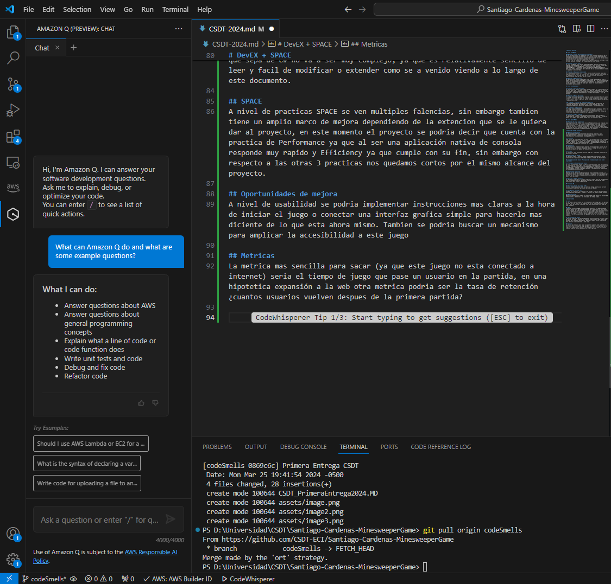

# ANALISIS REFACTOR

## Clase FieldModel

### Problema 1 (Falta de documentacion y pruebas)
Al ser un codigo legacy el readme que tiene solo contiene informacion de que programas se necestian para ejecutar, sin explicar el como deberia hacerse, sin embargo dentro del codigo se encuentra mas detallado el uso de las clases adicional a esto no se encuentran pruebas del juego.
Solucion crear un readme que ademas de los requisitos previos contenga el como se puede ejecutar el juego y las pruebas una vez esten hechas.

### Problema 2 (Clase Dios)
La clase FieldModel tiene muchas responsabilidades. Gestiona los datos del campo de minas(mineField), las dimensiones(rows, cols), y tiene métodos para comprobar los límites(checkBounds), calcular las minas adyacentes(adjacentsMines), y establecer valores por defecto(setDefaultFieldValue).
Esta clase podría beneficiarse de la división de sus funcionalidades en clases más pequeñas y más centradas.

### Problema 3 Mejoras de rendimiento 
El método adjacentsMines itera a través de las ocho direcciones para cada cuadrado, incluso si está en el borde. Esto se puede optimizar comprobando si el cuadrado está en el borde antes de iterar a través de direcciones específicas que estarían fuera de los límites.

### Problema 4 Numeros máicos
El código utiliza valores codificados en el método adjacentsMines como el tamaño de las matrices directionRow y directionCol (8) y los valores dentro de ellas (que representan las direcciones circundantes). se puede considerar el uso de constantes o métodos de ayuda para mejorar la legibilidad y la facilidad de mantenimiento.

## Clase FieldValidator

### Problema 5 Valores codificados 
El código utiliza valores codificados como por ejemplo los límites superior e inferior para filas y columnas válidas (1 y 100),las longitudes del array en directionRow y directionCol una forma de solucionarlo seria mediante el uso de constantes o métodos de ayuda que haría el código más legible y fácil de mantener.

### Problema 6 Manejo de errores
 El código termina abruptamente el programa usando Environment.Exit(0) cuando encuentra errores de entrada. Sería mejor lanzar excepciones para un manejo de errores más robusto y permitir que el código de nivel superior atrape y se recupere con gracia.

 ### Problema 7 Principio de responsabilidad unica
 La clase FieldValidator maneja tanto la validación de entrada como la impresión de mensajes. Sería mejor crear clases separadas para estas responsabilidades para mejorar el mantenimiento y la comprobabilidad.

 ### Problema 8 UI Expirience
 El código llama repetidamente a Console.ReadLine() para introducir datos, lo que puede resultar tedioso para el usuario. se peude considerar la posibilidad de utilizar un bucle para la entrada continua o un enfoque de interfaz de usuario más interactivo si es posible.

### Problema 9 Logica repetida
El código tiene múltiples comprobaciones condicionales para entradas no válidas que son similares. Se peudene utilizar métodos de ayuda o extraer la lógica común podría hacer que el código fuera más conciso y legible.

## Clase SquareModel

### Problema 10 Copia superficial
Copia superficial: El método Clone utiliza MemberwiseClone, que crea una copia superficial del objeto. Si alguna de las propiedades es de tipo referencia (como los objetos más complejos), esto podría provocar un comportamiento inesperado si esas referencias se modifican en una instancia, ya que también se modificarían en la instancia clonada. se peude considerar la posibilidad de implementar un mecanismo de copia profunda si es necesario.

# Clean code and XP Practices

### Nombres significativos
El código emplea nombres de variables descriptivos como rows, cols, squaresMatrixInput, y nombres de funciones que reflejan su propósito (checkRowsCols, CheckNumInRange, checkSquaresMatrix).

### Funciones
Cada función de este código hace una cosa y la hace bien, que es un principio clave del código limpio. Por ejemplo, checkRowsCols comprueba si las filas y columnas elegidas por el usuario son válidas, CheckNumInRange comprueba si un número cae dentro de un rango especificado, y checkSquaresMatrix comprueba si los cuadrados elegidos por el usuario son válidos.

### Comentarios
El código utiliza comentarios para explicar su funcionalidad, lo cual es una buena práctica. Sin embargo, en algunos casos, el código se explica por sí mismo y los comentarios pueden ser innecesarios.

### Formato
El código está bien formateado. Utiliza sangrías y espaciados coherentes que facilitan su lectura.

### Simplicidad del código
El código es simple y directo. No hay complejidades innecesarias, lo que concuerda con el principio KISS (Keep It Simple, Stupid) de código limpio.

## Recomendaciones de mejora (Principios de prgramación que no se estan cumpliendo)

### Principio de Responsabilidad Única
La clase FieldValidator maneja múltiples responsabilidades como la validación de la entrada del usuario para filas y columnas (checkRowsCols), validación de entradas cuadradas individuales (checkSquaresMatrix), impresión de mensajes (printMessage). Se puede considerar la posibildiad de refactorizar estas funcionalidades en clases o métodos separados y más específicos para mejorar su mantenimiento y reutilización. 

### Tratamiento de errores
Mientras que el código sale del programa en caso de entrada no válida, un enfoque más robusto sería devolver mensajes o códigos de error apropiados para permitir que el código de llamada maneje las excepciones con elegancia y de manera mucho mas clara.

### DRY (Don't Repeat Yourself)
La lógica para comprobar el rango de números se repite tanto en checkRowsCols como en checkSquaresMatrix. Encapsule esta lógica en un método de ayuda reutilizable para evitar la duplicación.

## Practicas XP

### Desarrollo basado en pruebas (TDD)
Escribir pruebas unitarias antes (o junto) al código garantiza su correcto funcionamiento y detecta regresiones durante los cambios.

### Integración continua (IC)
Integrar con frecuencia los cambios en el código y probarlos automáticamente ayuda a detectar problemas a tiempo y a mantener una base de código estable.

### Refactorización
Revisar y refactorizar el código con regularidad puede mejorar su legibilidad, mantenimiento y adherencia a los principios del código limpio.

# DevEX + SPACE

## DevEx
Por el lado de DevEx tenemos que el entendimiento del codigo para una persona que sepa de C# no va a ser muy complejo, ya que es relativamente sencillo de leer y facil de modificar o extender como se a venido viendo a lo largo de este documento.

## SPACE
A nivel de practicas SPACE se ven multiples falencias, sin embargo tambien tiene un amplio marco de mejora dependiendo de la extencion que se le quiera dar al proyecto, en este momento el proyecto se podria decir que cuenta con la practica de Performance ya que al ser una aplicación nativa de consola responde muy rapido y Efficiency ya que cumple con su fin, sin embargo con respecto a las otras 3 practicas nos quedamos cortos por el mismo alcance del proyecto.

## Oportunidades de mejora
A nivel de usabilidad se podria implementar instrucciones mas claras a la hora de iniciar el juego o conectar una interfaz grafica simple para hacerlo mas diciente de lo que esta ahora mismo. Tambien se podria buscar un mecanismo para amplicar la accesibilidad a este juego

## Metricas
La metrica mas sencilla para sacar (ya que este juego no esta conectado a internet) seria el tiempo de juego que pase un usuario en la partida, en una hipotetica expansión a la web otra metrica podria ser la tasa de retención ¿cuantos usuarios vuelven despues de la primera partida?

## Herramienta IA
Para este paso decidi implementar en el proyecto CodeWhisperer ya que en el taller use GitHub Copilot y queria explorar otra herramienta, de momento se aprecia que tiene un chat como Chat GPT o cualquier app similar 

Adicional al editor de sugerencias como se uso en el taller de GitHub Copilot, realmente son muy similares y lo que incluye adicional es el chat en vivo con la IA para realizar preguntas directamente sobre el proyecto, un ayudante bastante util.