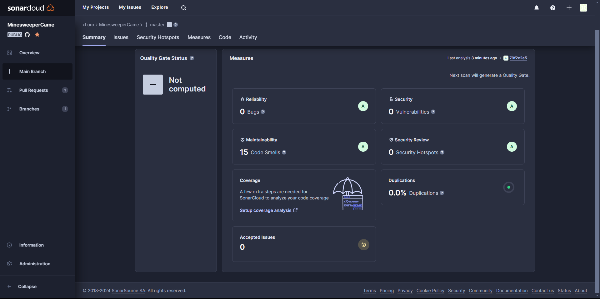
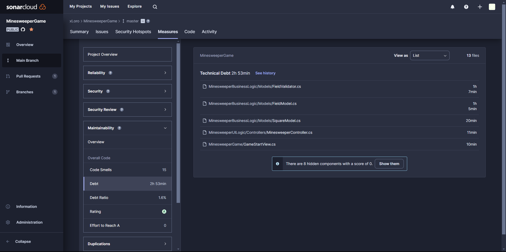
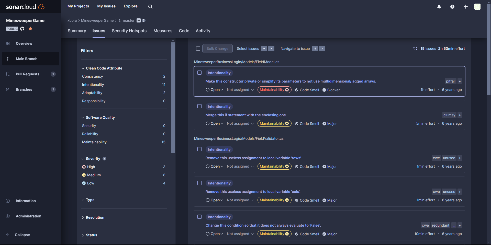

# SonarCloud

Haciendo uso de la aplicacion virtual de sonarCloud sobre el codigo base de MinesweeperGame se encontro lo siguiente a un nivel general.

## Medidas

Se puede observar que realmente el proyecto al ser tan pequeño no tiene realmente problemas grabes, ya que por un lado no maneja información sensible, tampoco se detectaron bugs. Sin embargo a nivel de la mantenibilidad del codigo encontramos ciertas mejoras que sonarCloud detecto.

## Problemas

Como se puede observar sonarCLoud detecto un porcentaje del 1.6% de deuda tecnica en las clases principales y 15 codeSmells.
Analizando los issues que detecta el programa nos encontramos con los ya antes mencionados en el archvio 'CSDT-2024.md'.

Sin embargo todos siguen siendo problemas de mantenibilidad y la mayoria se encuentran en un sector medio de impacto.

## Seguridad

El codigo al no tener peticiones reales con la Web y no requerir conexion con internet no tiene realmente vulnerabilidades de seguridad ya que no llega a ser atractivo para un atacante es por esto que para esta seccion queda vacio.

## Conclusión

En resumen el codigo es un codigo pequeño de un juego, que por el tiempo que lleva se notan diferentes malas practicas que a tenido a lo largo de los años, sin embargo no llegan a ser criticas ni mucho menos, la aplicacion es totalmente funcional. Puede que con todo lo expuesto en los archivos ".md" se pueda mejorar el rendimiento del juego o incluso el entendimiento del mismo ya que de cara al usuario llegar a ser algo complejo y en un futuro pensar en como escalarlo a nivel de aplicación web para darle un poco mas de complejidad y dinamismo. 